# Publishing Guide

This project uses an automated CI/CD pipeline with three separate GitHub Actions workflows for maximum security and isolation.

## 🚀 Workflow Overview

### 1. CI Pipeline (`.github/workflows/ci.yml`)

**Trigger:** Every push to `main` and all pull requests  
**Permissions:** `contents: read`, `pull-requests: write`  
**Purpose:** Build, test, lint, and check formatting

- ✅ Runs on every PR and main branch push
- 📋 Comments on PRs about formatting issues (no auto-fix for security)
- ❌ Fails if formatting/lint/test issues exist (requires manual fix)
- 🔒 **Read-only access** - cannot modify repository contents
- 🛡️ Maximum security with minimal permissions

### 2. Version Bump Pipeline (`.github/workflows/version-bump.yml`)

**Trigger:** After CI succeeds on main branch pushes  
**Permissions:** `contents: write`  
**Purpose:** Automatically bump version based on commit message analysis

- 🔍 Runs only after CI workflow succeeds on main
- 📝 Analyzes commit messages for version bump keywords
- 🔢 Supports automatic patch/minor/major version bumps
- 📋 Commits version changes and creates git tags
- 🔒 Only modifies version files, never touches source code

### 3. Auto-Publish Pipeline (`.github/workflows/auto-publish.yml`)

**Trigger:** After version bumps are detected on main  
**Permissions:** `contents: write` (releases only), `id-token: write`  
**Purpose:** Automatically publish when version bumps are detected

- 🔍 Runs when `package.json` version > published NPM version
- 📦 Publishes to NPM with provenance
- 📋 Creates GitHub releases (uses existing tags from version-bump)
- 🚀 **Never modifies files** - only creates releases and publishes
- 🔒 Only publishes, never modifies code

### 4. Manual Publish Pipeline (`.github/workflows/manual-publish.yml`)

**Trigger:** Manual workflow dispatch  
**Permissions:** `contents: write`, `id-token: write`  
**Purpose:** Manual version bumping and publishing with dry-run support

- 👤 Manually triggered from GitHub Actions UI
- 🔢 Supports patch/minor/major version bumps
- 🔍 Includes dry-run mode for testing
- 📝 Commits version bump to main
- 📦 Publishes to NPM after version bump

## 🔄 How It Works

### Development Workflow

#### Automatic Version Bump Flow (Recommended)

1. **Create PR** → CI runs validation and comments on formatting issues
2. **Fix issues locally** → Run `npm run format` and push changes
3. **Merge to main with semantic commit** → CI validates, then triggers version bump
4. **Version bump** → Analyzes commit message and bumps version automatically
5. **Auto-publish** → Detects version change and publishes to NPM

#### Manual Version Bump Flow

1. **Create PR** → CI runs validation
2. **Merge to main** → CI validates
3. **Manual version bump** → Use Manual Publish workflow from GitHub UI
4. **Auto-publish** → Publishes after manual version bump

### Commit Message Keywords for Auto-Versioning

The Version Bump workflow analyzes commit messages for these keywords:

```bash
# Major version bump (1.0.0 → 2.0.0)
git commit -m "feat: breaking change to API"
git commit -m "major: redesign template system"
git commit -m "BREAKING CHANGE: remove deprecated methods"

# Minor version bump (1.0.0 → 1.1.0)
git commit -m "feat: add new code generator"
git commit -m "feature: implement template caching"

# Patch version bump (1.0.0 → 1.0.1)
git commit -m "fix: resolve template parsing issue"
git commit -m "bug: handle edge case in loader"
git commit -m "hotfix: critical security update"

# No version bump
git commit -m "docs: update README"
git commit -m "chore: update dependencies"
git commit -m "style: fix formatting"
```

### Key Security Features

- 🛡️ **Principle of Least Privilege**: Each workflow has only minimal required permissions
- 🔒 **Read-Only CI**: CI workflow cannot modify repository contents
- � **Sequential Triggers**: Workflows trigger each other, preventing unauthorized execution
- 📝 **Controlled Version Bumps**: Only version/package files modified, never source code
- 🏷️ **Isolated Publishing**: Only dedicated workflows can create tags and publish
- 💬 **Transparent Communication**: CI comments on PRs instead of auto-fixing
- 🚫 **No Bypass**: All changes go through the complete validation pipeline

### Publishing Process

#### Option 1: Manual Publish (Recommended)

1. Go to **Actions** → **Manual Publish**
2. Click **Run workflow**
3. Select version bump type (patch/minor/major)
4. Optionally enable dry-run for testing
5. Workflow will version bump and publish automatically

#### Option 2: Manual Version Bump + Auto-Publish

1. Manually update `package.json` version
2. Commit and push to main
3. Auto-publish will detect the version change and publish

## 🔧 Required Setup

### 1. NPM Token Setup

To publish to NPM, you need to set up an NPM access token:

1. **Create NPM Account**: If you don't have one, create an account at [npmjs.com](https://www.npmjs.com/)

2. **Generate Access Token**:

   ```bash
   npm login
   npm token create --type=granular --scope=@your-scope
   ```

   Or use the NPM website:

   - Go to [NPM Access Tokens](https://www.npmjs.com/settings/tokens)
   - Click "Generate New Token"
   - Choose "Granular Access Token"
   - Set appropriate permissions for publishing

3. **Add Token to GitHub Secrets**:
   - Go to your GitHub repository
   - Navigate to: Settings → Secrets and variables → Actions
   - Click "New repository secret"
   - Name: `NPM_TOKEN`
   - Value: Your NPM access token

### 2. Repository Permissions

**✅ Default Setup (Recommended)**  
The workflows are designed to work with default GitHub permissions. No additional setup should be needed.

**🔧 If You Encounter Permission Issues:**

1. **Go to Repository Settings** → **Actions** → **General**
2. **Workflow permissions**: Select "Read and write permissions"
3. **Allow GitHub Actions to create and approve pull requests**: ✅ Check this

### 3. Package Configuration

Make sure your `package.json` has the correct configuration:

```json
{
  "name": "@your-scope/wgsl-template",
  "publishConfig": {
    "access": "public",
    "registry": "https://registry.npmjs.org/"
  }
}
```

## 🔐 Security Considerations for `contents: write`

### ⚠️ **Risks of `contents: write` Permission**

**High-Risk Capabilities:**

- 📝 Can modify any file in the repository
- 🌿 Can push to any branch (including main)
- 🏷️ Can create/delete branches and tags
- 🔄 Can potentially bypass branch protection rules
- 🚀 If compromised, could inject malicious code

### 🔒 **Implemented Security Controls**

**Current Risk Mitigation:**

1. **Version Bump (Pipeline 2)**:

   - ✅ Only runs after CI succeeds
   - ✅ Only modifies `package.json` and `package-lock.json`
   - ✅ Creates git tags for releases
   - ⚠️ Has `contents: write` but scope is minimal

2. **Auto-Publish (Pipeline 3)**:

   - ✅ No file modifications (only GitHub releases)
   - ✅ Uses existing tags from version-bump
   - ✅ Only publishes to NPM
   - ⚠️ Has `contents: write` only for release creation

3. **Manual Publish (Pipeline 4)**:
   - ✅ Requires explicit human authorization
   - ✅ Supports dry-run testing
   - ✅ Only runs when manually triggered
   - ⚠️ Has full version bump capabilities

**Reduced Attack Surface:**

- 🔻 Auto-publish no longer creates git tags
- 🔻 File modifications limited to version-bump only
- 🔻 Each workflow has specific, limited responsibilities

#### **1. Strict Trigger Controls**

```yaml
# Version Bump: Only after CI succeeds
workflow_run:
  workflows: ["CI"]
  types: [completed]
  branches: [main]
if: github.event.workflow_run.conclusion == 'success'

# Auto-Publish: Only after version detection
if: |
  github.event_name == 'push' &&
  github.ref == 'refs/heads/main'

# Manual Publish: Requires explicit human authorization
workflow_dispatch:
```

#### **2. Limited File Scope**

Each workflow only modifies specific files:

- **Version Bump**: Only `package.json` + `package-lock.json`
- **Auto-Publish**: Only creates git tags (no file changes)
- **Manual Publish**: Only version files during bump phase

#### **3. Branch Protection Requirements**

**Required Repository Settings:**

```bash
# Enable branch protection for main
Settings → Branches → Add rule for "main":
✅ Require status checks before merging
✅ Require up-to-date branches
✅ Include administrators
✅ Restrict pushes that create files (exceptions for GitHub Actions)
```

#### **4. Environment Restrictions**

**Recommended: Use GitHub Environments**

```yaml
# Add to sensitive workflows
environment: production
```

- Requires manual approval for production deployments
- Restricts who can trigger workflows
- Adds additional audit trail

#### **5. Secrets and Token Management**

- ✅ Use repository secrets, never hardcode tokens
- 🔄 Rotate NPM tokens regularly
- 🔍 Use fine-grained NPM tokens (not classic tokens)
- 📋 Audit token permissions periodically

#### **6. Monitoring and Alerts**

```yaml
# Add to all workflows with contents: write
- name: Security Audit
  run: |
    echo "🔍 Workflow: ${{ github.workflow }}"
    echo "🔍 Trigger: ${{ github.event_name }}"
    echo "🔍 Actor: ${{ github.actor }}"
    echo "🔍 Repository: ${{ github.repository }}"
    echo "🔍 Commit: ${{ github.sha }}"
```

### 🚨 **Additional Hardening Recommendations**

#### **Option A: Further Restrict Auto-Publish (Most Secure)**

Remove `contents: write` from auto-publish, only allow tag creation:

```yaml
# Auto-publish with minimal permissions
permissions:
  id-token: write # For NPM publishing only
# Let version-bump create tags instead
```

#### **Option B: Add Manual Approval Gates**

```yaml
# Require manual approval for version bumps
environment:
  name: version-control
  required_reviewers: ["admin-team"]
```

#### **Option C: Separate Version Bump from Publishing**

- Version Bump: Creates PR with version changes
- Human reviews and merges PR
- Auto-Publish: Triggered by merge

### 🔍 **Security Audit Checklist**

**Repository Configuration:**

- [ ] Branch protection enabled on main
- [ ] Required status checks configured
- [ ] Admin enforcement enabled
- [ ] Signed commits required (optional)

**Workflow Security:**

- [ ] All triggers are restrictive and specific
- [ ] No hardcoded secrets in workflow files
- [ ] File modifications are limited to version files only
- [ ] Audit logging present in all workflows

**Access Control:**

- [ ] Repository write access limited to maintainers
- [ ] NPM tokens use minimal required scopes
- [ ] GitHub environments configured for sensitive operations
- [ ] Regular access reviews scheduled

**Monitoring:**

- [ ] GitHub notifications enabled for workflow runs
- [ ] NPM publish notifications configured
- [ ] Failed workflow alerts set up
- [ ] Regular security audit of workflow history

### Common Issues

**CI Permission Errors:**

- Error: `permission denied to github-actions[bot]`
- Solution: Enable "Read and write permissions" in Settings → Actions → General

**Auto-Publish Not Triggered:**

- Ensure CI passes first
- Check that `package.json` version > published NPM version
- Verify `NPM_TOKEN` secret is configured

**Manual Publish Failures:**

- Check NPM token permissions
- Ensure package name is unique
- Use dry-run mode to test first

### Monitoring

Check the **Actions** tab in your GitHub repository to monitor:

- ✅ CI build status and test results
- 📦 Auto-publish status and version detection
- 🔧 Manual publish executions and results

### Manual Recovery

If auto-publishing fails, use the Manual Publish workflow:

1. Go to **Actions** → **Manual Publish**
2. Click **Run workflow**
3. Select version bump type
4. Optionally enable dry-run to test
5. Execute the workflow

### Workflow Execution Order

```mermaid
graph TD
    A[Push to Main] --> B[CI Workflow]
    B -->|✅ Success| C[Version Bump Workflow]
    B -->|❌ Failure| E[Stop - Fix Issues]
    C -->|Has Keywords| D[Bump Version + Commit]
    C -->|No Keywords| F[Skip Version Bump]
    D --> G[Auto-Publish Workflow]
    F --> G
    G -->|Version Changed| H[Publish to NPM + Create Release]
    G -->|No Change| I[Skip Publish]
```



**Sequential Execution:**

1. **CI** validates code quality (read-only)
2. **Version Bump** analyzes commits and updates version (if needed)
3. **Auto-Publish** detects version changes and publishes (if needed)

Each workflow waits for the previous one to complete successfully, ensuring a safe and predictable release process.
